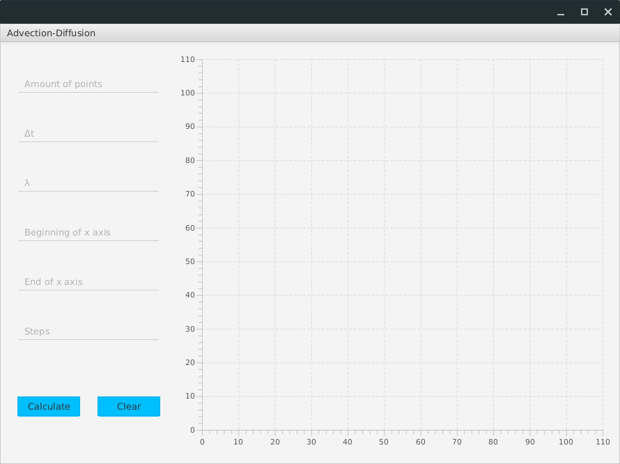
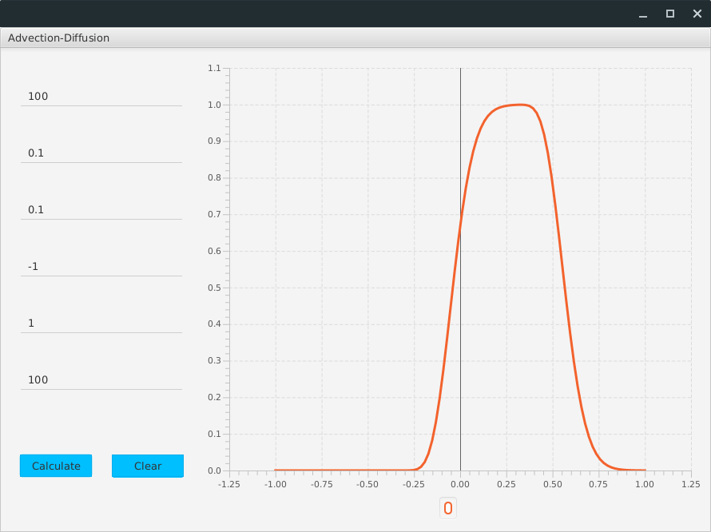

# Advection with diffusion

This is project for numerical methods classes. It displays changes in time using advection with diffusion on chart
using JavaFX. After taking input form the user, program runs python scripts that generates values of X and Y axis, which will
be displayed on the chart.

## Getting Started

The program requires to have python3 and numpy python package installed, because it runs python script
in a Java Runtime

## Screenshots




```

```

